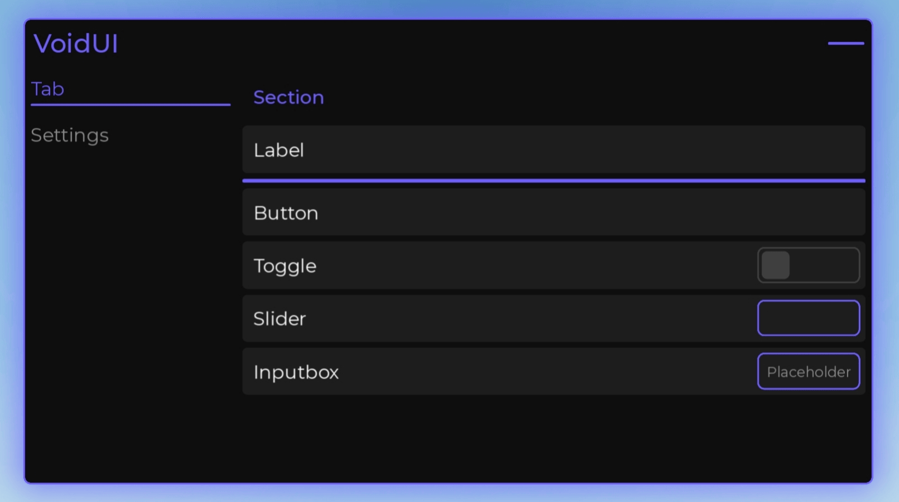
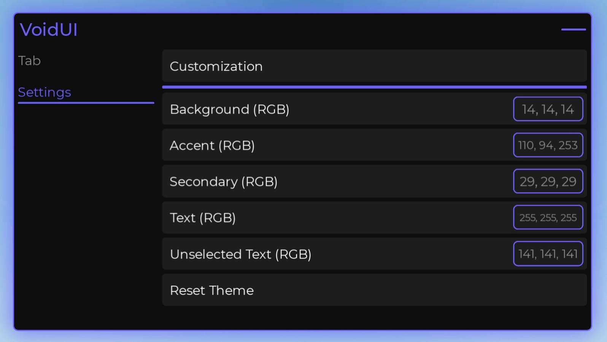

<div align="center">


</div>

<p align="center">
A lightweight, modern Roblox UI library with a clean API, built-in theme customization, and automatic settings saving.
</p>

---

# Screenshots

<p align="center">
  
</p>

<p align="center">
  
</p>

---

# Why Choose VoidUI?

- Lightweight and optimized
- Clean and intuitive API
- Built-in theme customization
- Automatic settings saving
- Built-in Settings tab
- Smooth animations
- Designed for both PC and mobile
- Easy to integrate into existing projects

---

# Installation

```luau
local VoidUI = loadstring(game:HttpGet("https://raw.githubusercontent.com/JustSomeGuest/VoidUI/Main/Source/Init.luau"))()
```

---

# API Documentation

## Window (Optional)

```luau
VoidUI:SetTitle("Title")
VoidUI:SetLogo("https://example.com/logo.png") -- Also supports rbxassetid://1234

VoidUI:SetTheme({
    Accent = "255, 0, 0",
    Secondary = "30, 30, 30",
    TextColor = "255, 255, 255",
    BackgroundColor = "10, 10, 10",
    NonSelectedTextColor = "150, 150, 150"
})
```

## Tab

```luau
local Tab = VoidUI:New("Tab", {
    Text = "Tab"
})
```

## Section

```luau
VoidUI:New("Section", {
    Text = "Section",
    Parent = Tab
})
```

## Label

```luau
VoidUI:New("Label", {
    Text = "Label",
    Parent = Tab
})
```

## Divider

```luau
VoidUI:New("Divider", {
    Parent = Tab
})
```

## Button

```luau
VoidUI:New("Button", {
    Text = "Button",
    Parent = Tab,
    Callback = function()
        print("Clicked")
    end
})
```

## Toggle

```luau
VoidUI:New("Toggle", {
    Text = "Toggle",
    Parent = Tab,
    Default = false,
    Callback = function(state)
        print(state)
    end
})
```

## Slider

```luau
VoidUI:New("Slider", {
    Text = "Slider",
    Parent = Tab,
    Min = 0,
    Max = 100,
    Callback = function(value)
        print(value)
    end
})
```

## Input Box

```luau
VoidUI:New("Inputbox", {
    Text = "Input Box",
    Parent = Tab,
    Placeholder = "Placeholder",
    Callback = function(text)
        print(text)
    end
})
```

---

# Built-in Settings

Every window automatically includes a **Settings** tab with the following options:

- Reset Theme
- Background Color (RGB)
- Accent Color (RGB)
- Secondary Color (RGB)
- Text Color (RGB)
- Unselected Text Color (RGB)
