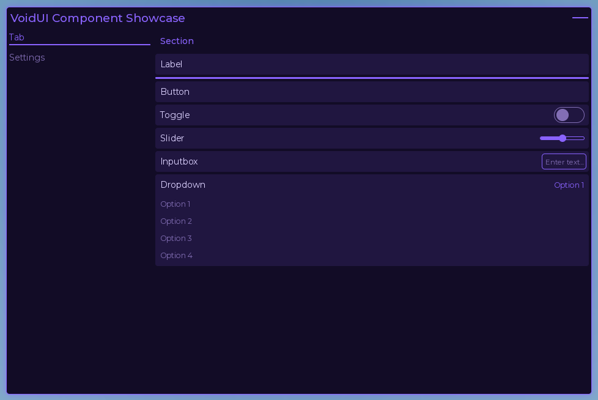
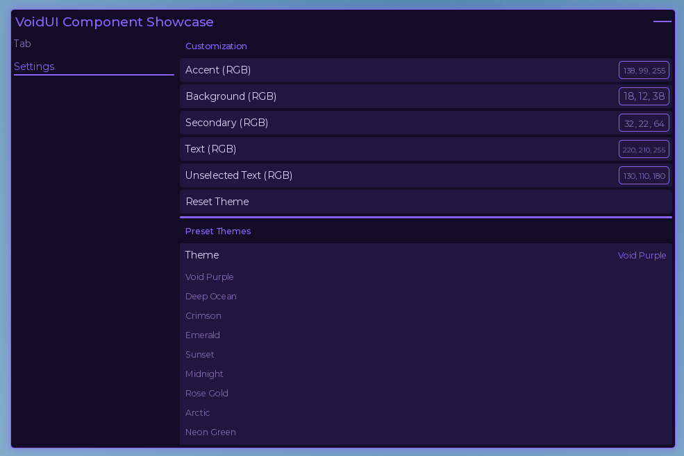
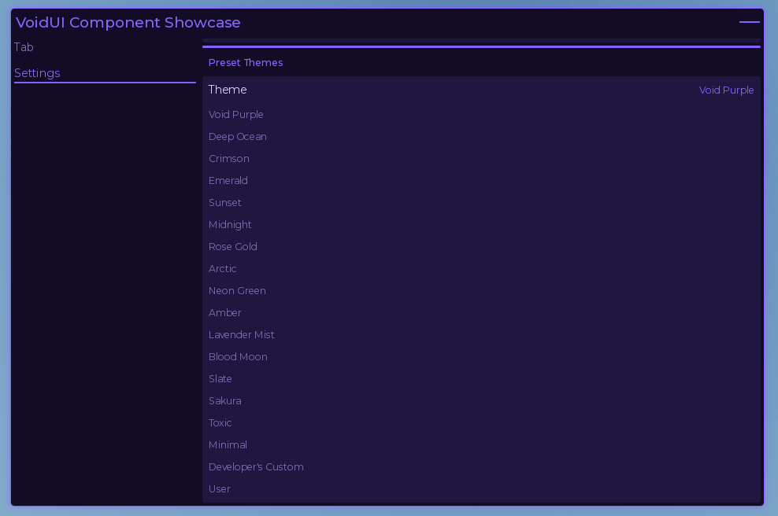
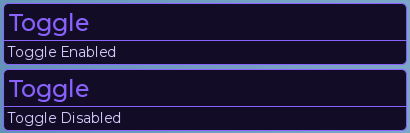

<div align="center"></div><p align="center">
A lightweight, modern Roblox UI library with a clean API, themes, settings, notifications, and key systems.
</p>

---

# Screenshots

<p align="center">
  
</p><p align="center">
  
  
</p><p align="center">
  
</p>

---

# Features

- Lightweight and optimized
- Simple API
- PC and mobile support
- Preset and custom themes
- Automatic settings saving
- Built-in Settings tab
- Notifications
- Key System
- Smooth animations

---

# Installation

```lua
local VoidUI = loadstring(game:HttpGet("https://raw.githubusercontent.com/JustSomeGuest/VoidUI/Main/Init"))()
```

---

# Example

See the [Example.luau](Source/Example.luau) file for setup, themes, notifications, and all available components.
