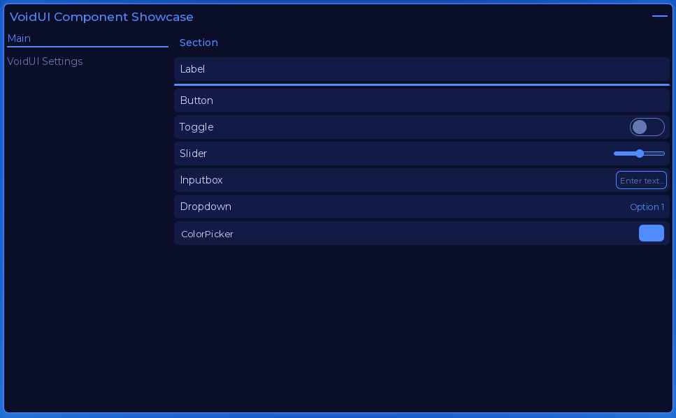
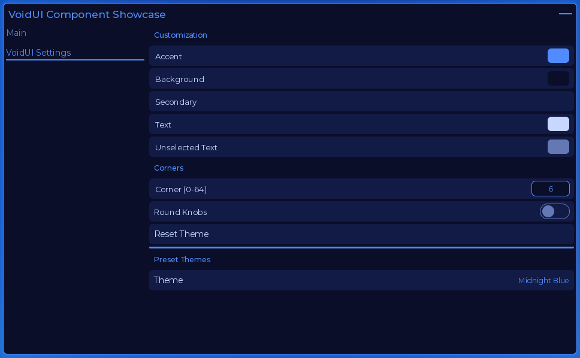
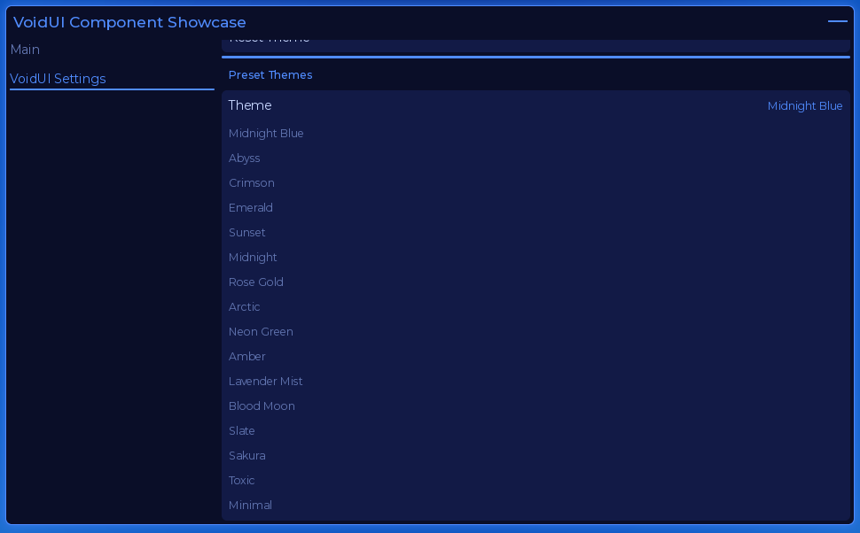
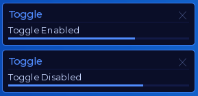

<div align="center"></div>
<p align="center">
A lightweight, modern Roblox UI library with a clean API, themes, settings, and notifications.
</p>

---

# Screenshots

<p align="center">
  
</p>

<p align="center">
  
  
</p>

<p align="center">
  
</p>

---

# Features

- Lightweight and optimized
- Simple API
- PC and mobile support
- Preset and custom themes
- Automatic settings saving
- Built-in Settings tab
- Notifications
- Smooth animations

---

# Installation

```lua
local VoidUI = loadstring(game:HttpGet("https://raw.githubusercontent.com/JustSomeGuest/VoidUI/Main/Source/Init.lua"))()
```

---

# Themes

VoidUI includes preset themes that can be applied by passing the theme name to SetTheme().

## Preset Themes

- Void Purple
- Deep Ocean
- Crimson
- Emerald
- Sunset
- Midnight
- Rose Gold
- Arctic
- Neon Green
- Amber
- Lavender Mist
- Blood Moon
- Slate
- Sakura
- Toxic
- Minimal
- User

### Using a Preset Theme

```lua
VoidUI:SetTheme("Deep Ocean")
```

Replace "Deep Ocean" with any of the preset theme names listed above.

### Custom Themes

You can also create your own theme by passing a theme table to SetTheme().

```lua
VoidUI:SetTheme({
    Accent = "255, 0, 0",
    Secondary = "30, 30, 30",
    TextColor = "255, 255, 255",
    BackgroundColor = "10, 10, 10",
    NonSelectedTextColor = "150, 150, 150"
})
```

Custom themes support:

- Accent
- BackgroundColor
- Secondary
- TextColor
- NonSelectedTextColor

The theme values use RGB strings in the format "R, G, B".

---

# Example

See the [Example.lua](Source/Example.lua) file for setup, themes, notifications, and all available components.
